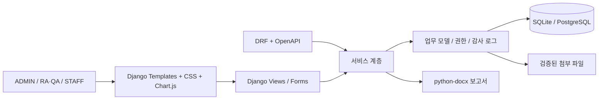

# 시스템 아키텍처

```mermaid
flowchart LR
  U["ADMIN / RA·QA / STAFF"] --> T["Django Templates + CSS + Chart.js"]
  T --> V["Django Views / Forms"]
  API["DRF + OpenAPI"] --> S["서비스 계층"]
  V --> S
  S --> M["업무 모델 / 권한 / 감사 로그"]
  M --> DB[("SQLite / PostgreSQL")]
  S --> DOC["python-docx 보고서"]
  M --> FS["검증된 첨부 파일"]
```
