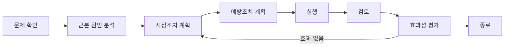

# CAPA 업무 흐름

```mermaid
flowchart LR
  A["문제 확인"] --> B["근본 원인 분석"] --> C["시정조치 계획"] --> D["예방조치 계획"] --> E["실행"] --> F["검토"] --> G["효과성 평가"] --> H["종료"]
  G -->|효과 없음| C
```

RA_QA와 ADMIN이 CAPA를 생성·수정하며, 종료와 재개는 ADMIN이 통제합니다. 완료에는 실제 완료일과 진행률 100%가 필요하고 종료에는 효과성 평가가 필요합니다.
