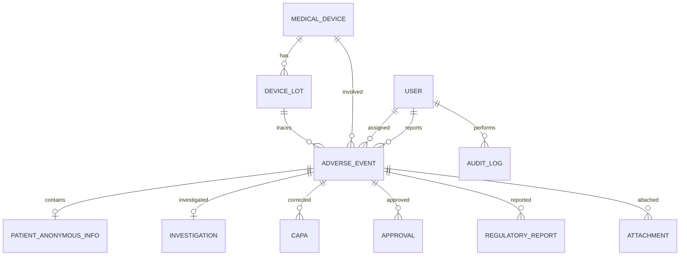

# 주요 데이터 모델 ERD

```mermaid
erDiagram
  USER ||--o{ ADVERSE_EVENT : reports
  USER ||--o{ ADVERSE_EVENT : assigned
  MEDICAL_DEVICE ||--o{ DEVICE_LOT : has
  MEDICAL_DEVICE ||--o{ ADVERSE_EVENT : involved
  DEVICE_LOT ||--o{ ADVERSE_EVENT : traces
  ADVERSE_EVENT ||--o| PATIENT_ANONYMOUS_INFO : contains
  ADVERSE_EVENT ||--o| INVESTIGATION : investigated
  ADVERSE_EVENT ||--o{ CAPA : corrected
  ADVERSE_EVENT ||--o{ APPROVAL : approved
  ADVERSE_EVENT ||--o{ REGULATORY_REPORT : reported
  ADVERSE_EVENT ||--o{ ATTACHMENT : attached
  USER ||--o{ AUDIT_LOG : performs
```

환자 이름, 주민등록번호, 전화번호 및 주소는 어떤 모델에도 저장하지 않습니다.
