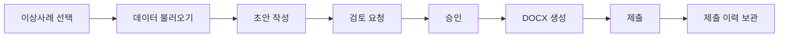

# 규제 보고서 업무 흐름

```mermaid
flowchart LR
  A["이상사례 선택"] --> B["데이터 불러오기"] --> C["초안 작성"] --> D["검토 요청"] --> E["승인"] --> F["DOCX 생성"] --> G["제출"] --> H["제출 이력 보관"]
```

시스템이 자동 반영한 내용은 수정할 수 있으며 최종 규제 판단과 제출 책임은 담당자에게 있습니다. 승인되지 않은 보고서는 생성·제출할 수 없습니다.
