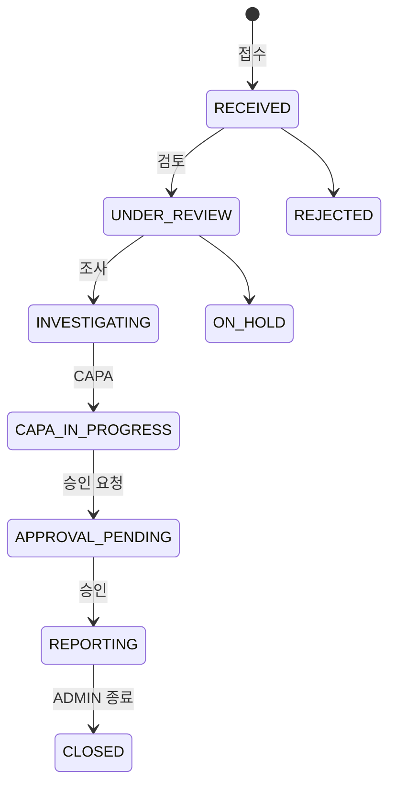

# 이상사례 처리 흐름

```mermaid
stateDiagram-v2
  [*] --> RECEIVED: 접수
  RECEIVED --> UNDER_REVIEW: 검토
  UNDER_REVIEW --> INVESTIGATING: 조사
  INVESTIGATING --> CAPA_IN_PROGRESS: CAPA
  CAPA_IN_PROGRESS --> APPROVAL_PENDING: 승인 요청
  APPROVAL_PENDING --> REPORTING: 승인
  REPORTING --> CLOSED: ADMIN 종료
  RECEIVED --> REJECTED
  UNDER_REVIEW --> ON_HOLD
```
